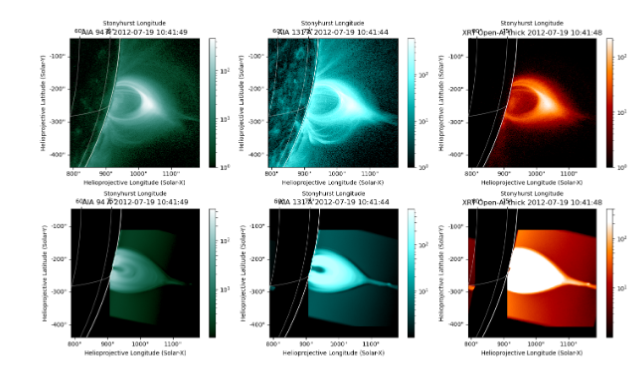

.. Rushlight documentation master file, created by
   sphinx-quickstart on Wed May 22 19:39:39 2024.
   You can adapt this file completely to your liking, but it should at least
   contain the root `toctree` directive.

Welcome to Rushlight's documentation!
=====================================

Rushlight is a tool to enhance comparisons between observations of high-energy solar events and 3D MHD models of such events.

The package leverages the functionalities of Sunpy_, CoronalLoopBuilder_, and Yt_ in order to perform projections and automatic alignment of model features to the observation site.

.. _Sunpy: https://sunpy.org/
.. _CoronalLoopBuilder: https://github.com/sageyu123/CoronalLoopBuilder
.. _Yt: https://yt-project.org/

Rushlight can be used to create synthetic observations and sunpy map objects compatible with the rest of the sunpy suite of functionality.

.. toctree::
   :maxdepth: 2
   :caption: Modules:

   proj_imag_classified
   color_tables
   uv
   xrt
   xray_bremsstrahlung

.. toctree::
   :maxdepth: 1
   :caption: Example notebooks:

   eg_aia_stereo_fetch
   eg_aia_stereo_pair
   eg_clb_loop

.. Check out the :doc:`usage` section for further information, including how to :ref:`install <installation>` the project.

Indices and tables
==================

* :ref:`genindex`
* :ref:`modindex`
* :ref:`search`
